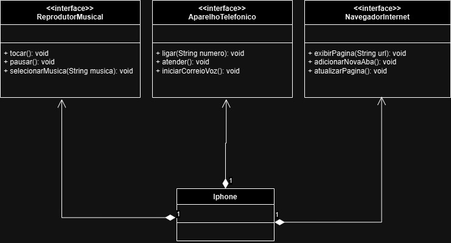

## Modelando Iphone com UML

A proposta desse desafio é elaborar a diagramação das classes e interfaces para representar os papéis do Iphone, que foram mostrados e falados na apresentação do primeiro Iphone, em 2007. Nesse caso, são: Reprodutor Musical, Aparelho Telefônico e Navegador na Internet.

A ideia é treinar a interpretação e a elaboração de um diagrama UML, e também treinar os pilares de POO.

Repositório original do projeto: [poo](https://github.com/digitalinnovationone/trilha-java-basico/tree/main/desafios/poo)

### Diagrama UML:

